### Hi there 👋

Here are some ideas to get you started:

- ➡️ Skilled developer of Dolibarr CRM modules
- 🔭 I’m currently working on a personal project that will be released soon
- 🌱 I’m currently learning Laravel + Livewire
- 👯 I’m looking to collaborate on PHP or Laravel related projects
- 💬 Ask me about ... anything
- 📫 How to reach me: milenmk@gmail.com
- ⚡ Fun fact: ... ask GPT, not me

&nbsp;

